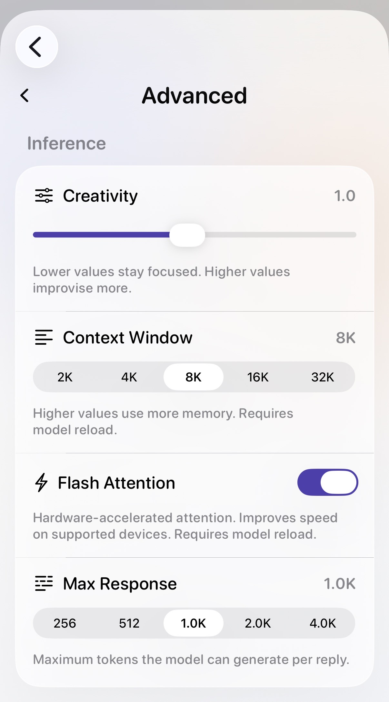
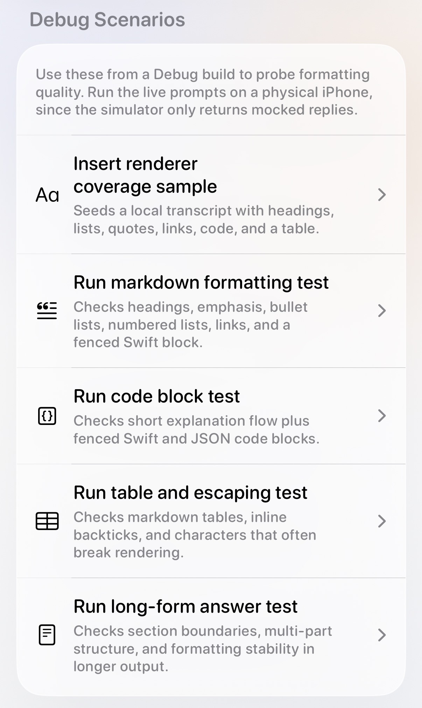
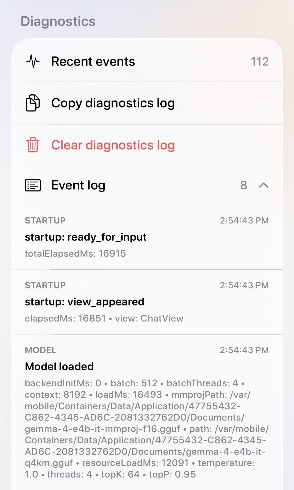

  <picture>
    <source media="(prefers-color-scheme: dark)" srcset="website/brand/y4-dark-256.png">
    
  </picture>

  <picture>
    <source media="(prefers-color-scheme: dark)" srcset="website/brand/domain-dark-600.png">
    
  </picture>

  
  
  
  
  

  <strong>AI that lives on your iPhone.</strong> 
  Good for notes, writing, questions, and image help. Private by design, offline after setup, and honest about what local AI does best.

  <a href="#what-its-good-for">What it's good for</a> ·
  <a href="#screenshots">Screenshots</a> ·
  <a href="#structure">Structure</a> ·
  <a href="#gemma-4-mlx-port">Gemma 4 MLX Port</a> ·
  <a href="#model-bundle">Model Bundle</a> ·
  <a href="#build">Build</a>

This repo contains the iOS app, landing page, and brand assets.

Yemma runs Gemma 4 E2B locally through a Swift-native MLX multimodal runtime. One model bundle handles both text and image flows. After a one-time download (~4.2 GB), the app works entirely offline — no cloud inference, no accounts, no telemetry.

## What it's good for

- Quick rewrites and everyday writing help
- Personal notes and thinking out loud
- Everyday questions answered on-device
- Image explanations and visual help
- Offline use — planes, commutes, anywhere without signal
- Low-friction, no-account AI when you just need a hand

Yemma is not trying to replace frontier cloud models. Where you need deep reasoning, broad world knowledge, or giant workflows, cloud AI is still better. Where you want something local, private, and always available, Yemma is a good fit.

## Features

- Streaming chat with markdown rendering, image attachments, and conversation history
- Resumable background model bundle download (~4.2 GB first-time setup)
- On-device multimodal text and image inference via `MLXVLM`
- Local model-bundle validation before the app marks setup complete
- Configurable response style, temperature, and response limits
- Light / Dark / System appearance modes
- Built-in diagnostics, debug probes, and simulator mock mode

## Screenshots

<table>
  <tr>
    <td width="33%">
      
    </td>
    <td width="33%">
      
    </td>
    <td width="33%">
      
    </td>
  </tr>
  <tr>
    <td valign="top"><strong>Advanced controls</strong> Temperature, context window, flash attention, response length.</td>
    <td valign="top"><strong>Debug probes</strong> Markdown and renderer test scenarios.</td>
    <td valign="top"><strong>Diagnostics</strong> Event log, copyable logs, runtime metadata.</td>
  </tr>
</table>

## Structure

- `ContentView.swift` — root state machine (onboarding vs chat)
- `LLMService.swift` — MLX multimodal load, generation, streaming, and runtime lifecycle
- `MLXModelSupport.swift` — model directory validation and Gemma 4 asset contract checks
- `ModelDownloader.swift` — single-repository download, resume, cleanup, and local validation
- `ConversationStore.swift` — chat history persistence
- `YemmaPromptPlanner.swift` — prompt shaping for the chat experience
- `Gemma4SmokeAutomation.swift` — smoke checks for the shipped model path
- `SettingsView.swift` / `AdvancedSettingsView.swift` — runtime tuning, diagnostics, debug probes
- `Appearance.swift` — theme system
- `website/` — landing page and brand assets

## Gemma 4 MLX Port

Yemma originally ran Gemma 4 through two separate GGUF assets: a text model plus a standalone `mmproj` vision projector. The current MLX integration replaces that with one Swift-native multimodal bundle and one runtime container.

The important distinction is that MLX Swift already provided the general model-loading, tokenizer, and VLM infrastructure. The missing work was Gemma 4 support on the Swift side, plus Yemma-specific integration around download, validation, prompt shaping, and runtime lifecycle.

Validated upstream baseline:

- `mlx-swift-lm` at `8b5eef7` for Gemma 4 model, processor, and parity fixes
- `mlx-swift-examples` at `31b6cf6` for app-side smoke validation and request-shaping patterns

How the current Yemma integration works:

- `Package.swift` pulls in `MLX`, `MLXLMCommon`, `MLXVLM`, `Hub`, and `Tokenizers`, so the runtime stays inside Swift instead of bridging through `llama.cpp` or Objective-C++ vision code.
- `ModelDownloader` pulls one MLX model repository, currently `mlx-community/gemma-4-e2b-it-4bit`, using `*.safetensors`, `*.json`, and `*.jinja` patterns instead of downloading a text GGUF and a second `mmproj` file. Yemma also recognizes legacy local bundles from `EZCon/gemma-4-E2B-it-4bit-mlx`.
- `ModelDirectoryValidator` proves the downloaded bundle is structurally usable by checking required metadata files, processor config, tokenizer files, weight shards, and safetensors index references before the app accepts setup as complete.
- `Gemma4MLXSupport` enforces the Gemma 4 multimodal asset contract in Swift by cross-checking processor and model values like soft-token budgets, patch size, and pooling kernel size. It also normalizes a known compatibility gap when a bundle is missing a top-level `pad_token_id`.
- `LLMService` converts each conversation turn into structured `Chat.Message` and `UserInput` values with optional image URLs, then calls `context.processor.prepare(input:)` so MLX performs the image and text preprocessing directly inside the same runtime path as inference.
- The current implementation uses `VLMModelFactory.shared._load(...)` to load the entire Gemma 4 VLM from one local directory, so text generation and image understanding live in one `ModelContainer` instead of separate GGUF and projector runtimes.
- Yemma still adds app-side stability logic around the MLX runtime, including prompt shaping, smoke checks, and output filtering for noisy hidden-channel and control-token responses.

What that buys us:

- no standalone `mmproj` download
- no Objective-C++ multimodal bridge
- one model bundle to download, validate, load, unload, and delete
- one Swift runtime path for both text-only and image-assisted turns

## Model Bundle

- Current default download source: [`mlx-community/gemma-4-e2b-it-4bit`](https://huggingface.co/mlx-community/gemma-4-e2b-it-4bit)
- Legacy-compatible local bundle ID: `EZCon/gemma-4-E2B-it-4bit-mlx`
- Approximate first-download size: `4.2 GB`
- Downloaded file classes: safetensors weights, tokenizer/config JSON, processor config, and chat template files
- Runtime contract: `config.json`, `tokenizer.json`, `tokenizer_config.json`, `processor_config.json` or `preprocessor_config.json`, plus one or more readable `.safetensors` weight files and any referenced safetensors index entries

After the bundle is downloaded, Yemma can load, unload, and run it entirely on device.

## Build

1. Open `Yemma4.xcodeproj` in a recent Xcode with Swift 6.1 support.
2. Run on a physical iPhone with iOS 17+ for real MLX inference.
3. Use `./scripts/sim_run.sh` for simulator testing with mocked replies.
4. Use `./scripts/device_startup_probe.sh` when you need a clean first-launch timing probe on device.

## Release

App Store Connect deployment via `asc-cli`.

## License

MIT. See [LICENSE](LICENSE).
