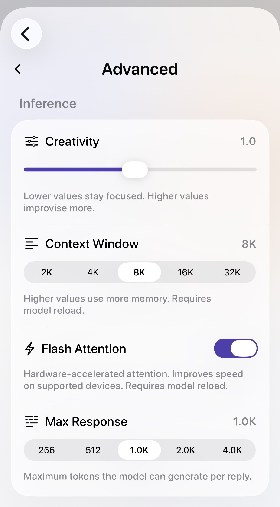
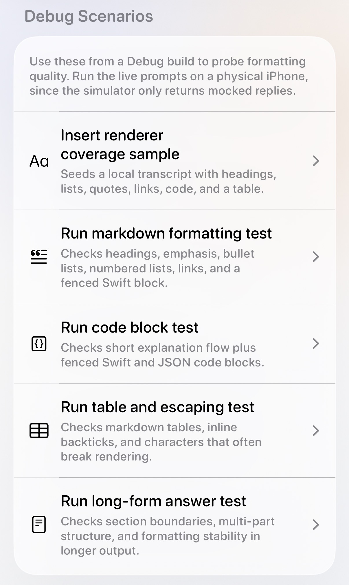
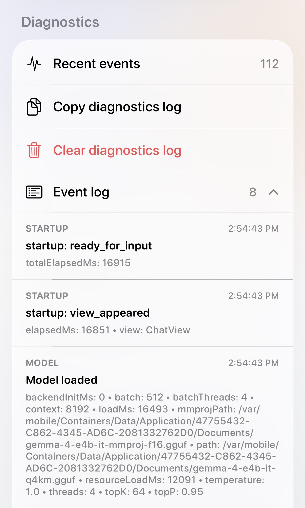

  <picture>
    <source media="(prefers-color-scheme: dark)" srcset="website/brand/y4-dark-256.png">
    
  </picture>

  <picture>
    <source media="(prefers-color-scheme: dark)" srcset="website/brand/domain-dark-600.png">
    
  </picture>

  
  
  
  
  

  <strong>AI that lives on your iPhone.</strong> 
  Good for notes, writing, questions, and image help. Private by design, on device, and honest about what local AI does best.

  <a href="#what-its-good-for">What it's good for</a> ·
  <a href="#screenshots">Screenshots</a> ·
  <a href="#structure">Structure</a> ·
  <a href="#runtime-selection">Runtime Selection</a> ·
  <a href="#optional-qwen35-4b-bundle">Optional Qwen Bundle</a> ·
  <a href="#build">Build</a>

This repo contains the iOS app, landing page, and brand assets.

On eligible iPhones running iOS 26 or newer with Apple Intelligence available, Yemma uses `SystemLanguageModel.default` for zero-download text chat. Qwen3.5 4B is an explicit optional 3.05 GB download for text and image chat, and the local choice for older or Apple Intelligence-ineligible devices. Yemma never downloads Qwen automatically. There is no cloud inference, no account, and no telemetry.

## What it's good for

- Quick rewrites and everyday writing help
- Personal notes and thinking out loud
- Everyday questions answered on-device
- Image explanations and visual help
- Offline use — planes, commutes, anywhere without signal
- Low-friction, no-account AI when you just need a hand

Yemma is not trying to replace frontier cloud models. Where you need deep reasoning, broad world knowledge, or giant workflows, cloud AI is still better. Where you want something local, private, and always available, Yemma is a good fit.

## Features

- Streaming chat with markdown rendering, image attachments, and conversation history
- Zero-download text chat through Apple Foundation Models on eligible iOS 26+ Apple Intelligence devices
- Explicit optional Qwen3.5 4B download (~3.05 GB) for text and image inference via `MLXVLM`
- Resumable background Qwen download and strict local bundle validation
- Configurable response style, temperature, and response limits
- Light / Dark / System appearance modes
- Built-in diagnostics, debug probes, and simulator mock mode

## Screenshots

<table>
  <tr>
    <td width="33%">
      
    </td>
    <td width="33%">
      
    </td>
    <td width="33%">
      
    </td>
  </tr>
  <tr>
    <td valign="top"><strong>Advanced controls</strong> Temperature, context window, flash attention, response length.</td>
    <td valign="top"><strong>Debug probes</strong> Markdown and renderer test scenarios.</td>
    <td valign="top"><strong>Diagnostics</strong> Event log, copyable logs, runtime metadata.</td>
  </tr>
</table>

## Structure

- `ContentView.swift` — root state machine (onboarding vs chat)
- `LLMService.swift` — runtime selection, generation, streaming, and MLX lifecycle
- `AppleFoundationModelRuntime.swift` — iOS 26 availability, Apple transcript shaping, and snapshot streaming
- `MLXModelSupport.swift` — model directory validation and Qwen3.5 4B asset contract checks
- `ModelDownloader.swift` — optional Qwen download, resume, cleanup, and local validation
- `ConversationStore.swift` — chat history persistence
- `ChatMessage.swift` — app-owned message, user, and attachment value types
- `YemmaPromptPlanner.swift` — prompt shaping for the chat experience
- `Qwen35SmokeAutomation.swift` — smoke checks for the shipped model path
- `ChatSidebarView.swift` / `AdvancedSettingsView.swift` — preferences, runtime tuning, diagnostics, and debug probes
- `DebugInferenceScenario.swift` — debug prompt and renderer scenarios
- `Appearance.swift` — theme system
- `website/` — landing page and brand assets

## Runtime Selection

- Simulator: deterministic mock replies; neither real runtime is invoked.
- Eligible iOS 26+ Apple Intelligence device: Apple Foundation Models is the zero-download initial runtime for text chat.
- iOS 17-25 or Apple Intelligence-ineligible device: Qwen3.5 4B is the initial runtime choice, but its 3.05 GB download begins only when the user starts setup.
- Images: choose the optional Qwen3.5 4B runtime. Yemma's Apple runtime is text-only.
- Apple Intelligence off, model not ready, or unsupported language: Yemma explains the unavailable state and lets the user enable Apple Intelligence or explicitly choose Qwen.

Both runtimes operate on device. Real inference requires a physical iPhone; Simulator builds keep using mock replies.

## Optional Qwen3.5 4B Bundle

Yemma offers one optional download: **Qwen3.5 4B Abliterated**, with text and vision in the same MLX package. Apple remains the default on eligible devices.

- Source: [`dream-vault-community/Qwen3.5-4B-4bit-Abliterated`](https://huggingface.co/dream-vault-community/Qwen3.5-4B-4bit-Abliterated)
- Pinned revision: `a40c9a8d5c6f6f70d678120ccb46a3f6456c727c`
- Download: approximately **3.05 GB**, including combined language and vision weights, tokenizer, image processor, image-aware chat template, license, and provenance.
- Lineage: Huihui's abliterated derivative of a Qwen3.5 4B reasoning distillation. The package preserves upstream weights and supplies Swift-compatible vision metadata. Its name is not a claim of Claude capability or affiliation.
- Runtime: the pinned `mlx-swift-lm` dependency supplies Qwen3.5 and Qwen3VL processing. Yemma uses one `VLMModelFactory` container for text and images.
- Validation: required metadata, matching image-aware templates, processor parameters, tensor payload boundaries, and all 24 vision blocks are checked before setup becomes ready. A text-only conversion is rejected even if its config claims vision support.
- Generation: thinking disabled, one system prompt, Qwen stop/reasoning tokens, and a 768-pixel image processing bound. Image replies remain capped at 256 tokens.

Installation and deletion stay explicit. Old Gemma files are never loaded as Qwen or deleted automatically; **Delete downloaded model** also removes any previous Gemma download. A saved Gemma choice falls back to the normal device-based initial selection and does not start a Qwen download.

Model-card vision tests were performed on a Mac, not an iPhone. Download size is not a RAM requirement. Physical-device inference, memory, and thermal behavior must be validated before claiming device compatibility.

## Build

1. Open `Yemma4.xcodeproj`; it is the sole build graph and owns the pinned SwiftPM dependencies.
2. Use Xcode 26 or newer with an iOS 26 SDK. The deployment target remains iOS 17 and the app and test targets currently compile in Swift 5 language mode.
3. Run `./scripts/local_validation.sh` for simulator tests plus an unsigned Release compile for a generic iOS device.
4. Run on a physical iPhone for real Apple Foundation Models or Qwen inference.
5. Use `./scripts/sim_run.sh` only when you also want to install and launch the mocked simulator app.
6. Use `./scripts/device_startup_probe.sh` when you need a clean first-launch timing probe on an already installed device build.

Lint (optional, not a build dependency): with [SwiftLint](https://github.com/realm/SwiftLint) installed, run `swiftlint lint --config .swiftlint.yml --quiet`.

## Release

App Store Connect deployment via `asc-cli`.

## License

MIT. See [LICENSE](LICENSE).
